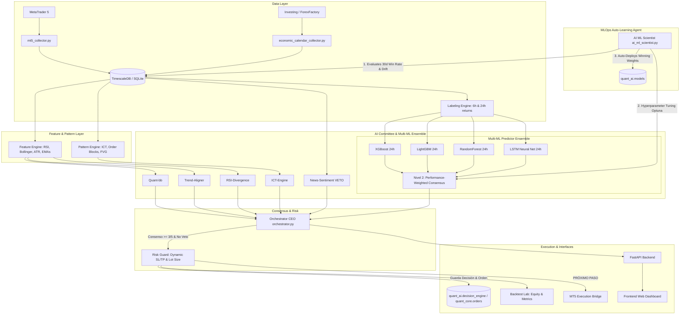

# 🚀 GoFound Quant Platform — Documento Maestro & Plan de Acción a Cuenta Demo

**Versión:** 1.8  
**Fecha:** Agosto 2026  
**Estado:** Documento Oficial de Arquitectura y Roadmap  
**Lema:** *"We don't predict markets. We discover opportunities."*  

---

## 📌 1. Resumen Ejecutivo & Filosofía del Proyecto

**GoFound Quant Platform** es una plataforma modular de investigación y trading cuantitativo para mercados de **Forex y Metales** (EUR/USD, GBP/USD, USD/JPY, XAU/USD, etc.). Su objetivo principal es centralizar datos de mercado, construir conocimiento accionable respaldado por evidencia estadística y ejecutar decisiones de inversión mediante un **Comité de Analistas de Inteligencia Artificial** con estricto control de riesgo.

### Principios Fundamentales
1. **Sin Intuición ni Predicción Fantasiosa:** No intentamos predecir el futuro del mercado de forma subjetiva; detectamos inconsistencias y ventajas estadísticas reproducibles.
2. **Decisiones Explicables & Transparentes:** Cada orden emitida por el sistema cuenta con una justificación de cada analista y un registro de votos guardado en base de datos.
3. **Filtro Macro de Protección (VETO):** Ante eventos económicos de alto impacto, la preservación de capital prioriza sobre la búsqueda de beneficios.

---

## 🛠️ 2. Arquitectura & Stack Tecnológico Actual



### Componentes Principales

| Capa | Tecnologías | Descripción |
| :--- | :--- | :--- |
| **Frontend Web** | HTML5, CSS3, JavaScript Vanilla / React-TS | Dashboard interactivo con telemetría del comité, matriz de datos y laboratorio de backtest. |
| **Backend API** | Python 3, FastAPI, Uvicorn, PyJWT | API REST con autenticación JWT, orquestación del comité y motor de simulación. |
| **Base de Datos** | TimescaleDB (PostgreSQL) / SQLite (`market_data.db`) | Almacenamiento masivo de series temporales de velas OHLCV, métricas y calendario económico. |
| **Comité IA** | Python (Pandas, NumPy, Scikit-Learn) | 5 analistas especializados en volatilidad, tendencia, momento, Smart Money y macroeconomía. |
| **Ensamble Multi-ML** | XGBoost + LightGBM + RandomForest + LSTM | Trío de árboles + Red Neuronal LSTM para secuencia temporal combinados por pesos dinámicos. |
| **Consenso Inteligente** | Nivel 2: Ponderación Dinámica | Pesos de voto asignados dinámicamente según el acierto real de los últimos 30 días. |
| **Científico ML Autónomo** | `ai_ml_scientist.py` (Optuna, MLOps Loop) | Agente de auto-aprendizaje que evalúa *drift*, optimiza hiperparámetros y recalibra pesos. |
| **Orquestador (CEO)** | Python (`agents/orchestrator.py`) | Servicio ejecutor que consolida votos, evalúa vetos, valida el RiskGuard y registra órdenes. |

---

## 🤖 3. El Comité de IA, el Orquestador y los Algoritmos Predictivos

El sistema de decisiones no depende de una "caja negra" única, sino de una **estructura de gobierno por comité supervisada por un Orquestador**:

### 🏛️ 3.1. El Orquestador ("CEO del Comité"): ¿Qué es, qué hace y qué guarda?

* **¿Es una base de datos? NO.** El Orquestador es un **módulo de servicio en Python** (`agents/orchestrator.py`), que actúa como el **CEO o Árbitro Principal del sistema**.
* **¿Qué hace exactamente?**
  1. **Consolidación de Votos:** Al cerrar cada vela, lee de la base de datos (`quant_ai.signals`) la evaluación individual de cada analista y del Ensamble ML.
  2. **Verificación de VETO:** Comprueba si `News-Sentiment` u otro analista emitió un `VETO`. Si hay un veto activo por noticias de alto impacto, aborta la operación y fuerza el resultado a `WAIT`.
  3. **Regla de Mayoría Estricta:** Exige al menos **3 votos coincidentes** (`BUY` o `SELL`) sin votos opuestos en contra.
  4. **Validación de Contexto:** Consulta `quant_market.market_context` para confirmar la ausencia de eventos económicos inminentes.
  5. **Evaluación de Riesgo (`RiskGuard`):** Si hay consenso, pasa la propuesta al `RiskGuard`, que calcula el Stop Loss dinámico ($1.5 \times \text{ATR}$), Take Profit ($2.0 \times \text{Riesgo}$) y verifica que el Ratio Riesgo/Beneficio sea $\ge 1.5$.
  6. **Filtro Anti-Duplicidad:** Verifica que no exista una orden abierta previamente para dicho símbolo en `quant_core.orders`.

* **¿Qué datos guarda y en qué tablas?**
  * **`quant_ai.decision_engine`:** Guarda el registro completo de la decisión (`recommendation`: BUY/SELL/WAIT, `consensus_score`, `reasoning`: explicación textual y `details`: JSON con los votos individuales y parámetros de riesgo).
  * **`quant_core.orders`:** Si la propuesta fue aprobada (`BUY` o `SELL`), genera y registra la **orden oficial de trading** (`direction`, `entry_price`, `size` en lotes, `sl`, `tp`, `status`: PENDING/FILLED, `is_paper`: TRUE/FALSE).

---

### 🔮 3.2. Ensamble Multi-Modelo (XGBoost + LightGBM + Random Forest + LSTM Neuronal)

El módulo predictivo a 24h/48h se compone de un **Ensamble de 4 Modelos Complementarios**:

1. **XGBoost (Gradient Boosting Extremo):** Captura interacciones no lineales complejas entre variables macroeconómicas y técnicas.
2. **LightGBM (Light Gradient Boosting Machine):** Ultra rápido y altamente eficiente en la segmentación de datos numéricos continuos de gran escala.
3. **Random Forest (Bosques Aleatorios):** Modelo inercial basado en bagging que aporta estabilidad y reduce la varianza ante ruido repentino del mercado.
4. **LSTM (Red Neuronal Recurrente / Temporal):** Red neuronal orientada a secuencias temporales para analizar la memoria de las últimas 50-100 velas.

---

### ⚙️ 3.3. Sistema de Votación Recomendado: Nivel 2 (Ponderación Dinámica por Rendimiento Reciente)

Para combinar las decisiones de los modelos de forma inteligente y adaptativa sin caer en el sobreajuste del *Stacking*, adoptamos la **Ponderación Dinámica por Rendimiento (Performance-Weighted Consensus)**:

$$\text{Voto}_{\text{Ensamble}} = \frac{w_1 \cdot P_{\text{XGB}} + w_2 \cdot P_{\text{LGB}} + w_3 \cdot P_{\text{RF}} + w_4 \cdot P_{\text{LSTM}}}{w_1 + w_2 + w_3 + w_4}$$

* **Funcionamiento Adaptativo:** Los pesos ($w_1, w_2, w_3, w_4$) se calculan semanalmente en función del *Win Rate* y el *Sharpe Ratio* real que ha tenido cada modelo durante los últimos 30 días.
* **Auto-Calibración:** Si un modelo pierde precisión por un cambio estructural en el mercado, su peso se reduce automáticamente a casi cero, evitando que contamine las decisiones del sistema.

---

### 🔬 3.4. Científico de ML Autónomo (`ai_ml_scientist.py`) & Auto-Aprendizaje

Para que la plataforma sea un **sistema de auto-aprendizaje continuo** que evolucione con el mercado sin intervención manual constante, introducimos el agente **`ai_ml_scientist.py`**:

```
                                  [ BUCLE DE AUTO-APRENDIZAJE MLOps ]
                                                  │
 ┌────────────────────────────────────────────────┴────────────────────────────────────────────────┐
 │                                                                                                 │
 ▼                                                ▼                                                ▼
1. Detección de Deriva (Drift)        2. Optimización (Optuna)                       3. Re-entrenamiento & Deploy
Compara predicciones pasadas vs.      Busca hiperparámetros óptimos                  Entrena y valida (Walk-Forward). Si supera
etiquetas reales en quant_market.labels (max_depth, learning_rate, n_estimators).   al modelo actual, actualiza quant_ai.models.
```

#### Funciones Principales del Científico de ML:

1. **Monitoreo de Deriva de Datos y Concepto (*Concept & Data Drift Detection*):**
   * Semanalmente, el agente compara las predicciones pasadas registradas en la plataforma contra los resultados reales que el motor [labeling.py](file:///c:/Users/Usuario/Desktop/Pablo/GoFound/GF-QP/gofound-quant/feature_engine/labeling.py) ha ido guardando en `quant_market.labels`.
   * Si detecta que la precisión del ensamble ha caído por debajo de un umbral aceptable, activa un ciclo de re-optimización.

2. **Búsqueda Bayesiana de Hiperparámetros (Optuna / Grid Search):**
   * El agente ajusta automáticamente la configuración interna de los algoritmos (`max_depth`, `learning_rate`, `n_estimators`, `subsample`, `colsample_bytree`).

3. **Validación Cruzada Walk-Forward & Despliegue Automático:**
   * Entrena las nuevas versiones sobre el historial extendido.
   * Realiza una validación en datos *fuera de muestra* (Out-of-Sample testing).
   * **Promoción a Producción:** Solo si la nueva versión supera la métrica ROC-AUC o *Accuracy* del modelo anterior en al menos $+\text{2.5}\%$, el científico autoriza y **actualiza automáticamente los pesos del modelo en `quant_ai.models`**.

---

## 🔁 4. Lo Desarrollado en la Última Sesión

De acuerdo a nuestro registro de cambios e historial de código:
* **Filtro VETO por Eventos Económicos Reales:** Se implementó la migración `010_economic_calendar.sql` y el colector de noticias macroeconómicas (2010–2026).
* **Consenso de Mayoría Estricta en Backend:** Se actualizó `main.py` y `orchestrator.py` para forzar que las señales requieran $3/5$ votos e incluyan formalmente la evaluación noticiosa.
* **Velas 100% Reales:** Eliminación total de datos sintéticos o simulados para garantizar que el backtesting sea estrictamente determinista.
* **Resiliencia en `ai_agent_researcher.py`:** Autodetector de puertos, fallback heurístico y registro de experimentos.

---

## 🚧 5. Análisis de Brechas: ¿Qué falta para Operar en Cuenta Demo Real?

Actualmente, la plataforma está **optimizada para investigación y simulación histórica (Backtesting)**. Para pasar a **Operación Automatizada en Tiempo Real (Cuenta Demo MT5)**, existen 5 componentes cruciales que aún debemos construir:

```
[ ESTADO ACTUAL: Backtesting Pasado ]  --->  [ ESTADO OBJETIVO: Operativa Demo en Tiempo Real ]
  • Descarga manual/batch de velas            • Bucle de escucha de velas en vivo (Live Loop)
  • Evaluación histórica sobre dataset         • Evaluación instantánea al cierre de cada vela
  • Métricas teóricas en pantalla             • Conexión física a MetaTrader 5 (order_send)
  • Sin gestión de órdenes abiertas           • Monitor de posiciones vivas, Sl/TP dinámico y Breakeven
```

---

## 🎯 6. Roadmap Crucial: 5 Pasos para la Operativa en Cuenta Demo

Para lograr la ejecución en vivo en una cuenta Demo de MetaTrader 5 sin poner en riesgo el capital ni colapsar la infraestructura, debemos seguir estos 5 pasos ordenados:

### 📍 PASO 1: Bucle Listener de Mercado en Tiempo Real (`live_market_loop.py`)
* **Qué hace:** Escucha el cierre de cada vela en tiempo real (ejemplo: cada vez que cierra una vela de M15 o M30 en MT5).
* **Acción:** Extrae la última vela, calcula las *features* actualizadas en la base de datos y llama al `Orchestrator`.

### 📍 PASO 2: Puente de Ejecución MT5 (`mt5_execution_bridge.py`)
* **Qué hace:** Módulo encargado de enviar órdenes físicas a la terminal MetaTrader 5 mediante la API oficial `MetaTrader5`.
* **Funciones:** `send_order()`, retries, control de slippage, margen y asignación de `Magic Number`.

### 📍 PASO 3: Gestor de Posiciones Vivables & Sync (`position_manager.py`)
* **Qué hace:** Rastrear posiciones abiertas en MT5, actualizando PnL flotante en tiempo real e implementando **Breakeven Automático** al alcanzar $TP_1$.

### 📍 PASO 4: Interruptor de Seguridad & Circuit Breaker (Risk Circuit Breaker)
* **Qué hace:** Si la cuenta Demo pierde más del $3.0\%$ en un día, se cancelan nuevas entradas por 24 horas. Máximo 1 posición abierta por símbolo a la vez.

### 📍 PASO 5: Módulo de Telemetría Live en el Dashboard Web
* **Qué hace:** Tarjeta de estado de la cuenta Demo (Balance, Equidad, Margen, PnL) y consola de logs del comité en vivo.

---

## 📋 7. Checklist de Preparación para la Siguiente Sesión

- [ ] Tener instalada la terminal de **MetaTrader 5** en el equipo local/VPS con una **Cuenta Demo activa**.
- [ ] Habilitar en MT5 la opción `"Permitir trading algorítmico"`.
- [ ] Ejecutar prueba de verificación de credenciales y conexión de la librería `MetaTrader5` en Python.
- [ ] Definir pares iniciales para el piloto Demo (Recomendado: `EURUSD` y `XAUUSD` en M30).

---

> *Este documento queda guardado en la raíz del proyecto (`DOCUMENTO_MAESTRO_PLAN_DEMO.md`) como guía oficial de referencia.*
